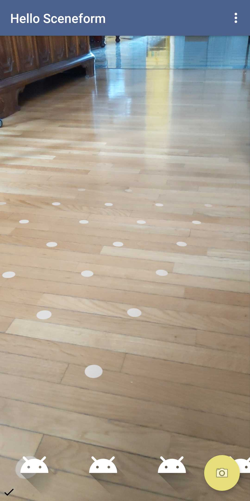

# Welcome to the ARCore & Sceneform Workshop

- Before we get started...
- Clone the project @ bit.ly/2HWr1D8
- These slides are linked from the README
- Make sure your Android Studio is updated to 3.1 or higher
- Set up an ARCore [supported device](https://developers.google.com/ar/discover/supported-devices)
- Or an ARCore [supported emulator](https://developers.google.com/ar/develop/java/emulator)

---

# About ARCore

- Google released ARCore in February 2018.
- ARCore helps devs build apps that can understand the environment around a device and place objects and information in it.

---

# About Sceneform

- Google followed up with Sceneform at I/O 2018.
- Sceneform helps devs render 3D scenes on Android without needing to learn OpenGL.

---

# Drawing a cube Before Sceneform

```java
public class Cube {
    private static final float VERTICES[] = { -0.5f, -0.5f, -0.5f, 0.5f, -0.5f, -0.5f, 0.5f, 0.5f, -0.5f, -0.5f, 0.5f, -0.5f, -0.5f, -0.5f, 0.5f, 0.5f, -0.5f, 0.5f, 0.5f, 0.5f, 0.5f, -0.5f, 0.5f, 0.5f};
    private static final float COLORS[] = { 0.0f, 1.0f, 1.0f, 1.0f, 1.0f, 0.0f, 0.0f, 1.0f, 1.0f, 1.0f, 0.0f, 1.0f, 0.0f, 1.0f, 0.0f, 1.0f, 0.0f, 0.0f, 1.0f, 1.0f, 1.0f, 0.0f, 1.0f, 1.0f, 1.0f, 1.0f, 1.0f, 1.0f, 0.0f, 1.0f, 1.0f, 1.0f};
    private static final byte INDICES[] = { 0, 1, 3, 3, 1, 2, 0, 1, 4, 4, 5, 1, 1, 2, 5, 5, 6, 2, 2, 3, 6, 6, 7, 3, 3, 7, 4, 4, 3, 0, 4, 5, 7, 7, 6, 5};
    private static final int COORDS_PER_VERTEX = 3;
    private static final int VALUES_PER_COLOR = 4;
    private final int VERTEX_STRIDE = COORDS_PER_VERTEX * 4;
    private final int COLOR_STRIDE = VALUES_PER_COLOR * 4;
    private static final String VERTEX_SHADER_CODE = "uniform mat4 uMVPMatrix;attribute vec4 vPosition;attribute vec4 vColor;varying vec4 _vColor;void main() {  _vColor = vColor;  gl_Position = uMVPMatrix * vPosition;}";
    private static final String FRAGMENT_SHADER_CODE = "precision mediump float;varying vec4 _vColor;void main() {  gl_FragColor = _vColor;}";
    private final FloatBuffer mVertexBuffer;
    private final FloatBuffer mColorBuffer;
    private final ByteBuffer mIndexBuffer;
    private final int mProgram;
    private final int mPositionHandle;
    private final int mColorHandle;
    private final int mMVPMatrixHandle;

    public Cube() {
        ByteBuffer byteBuffer = ByteBuffer.allocateDirect(VERTICES.length * 4);
        byteBuffer.order(ByteOrder.nativeOrder());
        mVertexBuffer = byteBuffer.asFloatBuffer();
        mVertexBuffer.put(VERTICES);
        mVertexBuffer.position(0);
        byteBuffer = ByteBuffer.allocateDirect(COLORS.length * 4);
        byteBuffer.order(ByteOrder.nativeOrder());
        mColorBuffer = byteBuffer.asFloatBuffer();
        mColorBuffer.put(COLORS);
        mColorBuffer.position(0);
        mIndexBuffer = ByteBuffer.allocateDirect(INDICES.length);
        mIndexBuffer.put(INDICES);
        mIndexBuffer.position(0);
        mProgram = GLES20.glCreateProgram();
        GLES20.glAttachShader(mProgram, loadShader(GLES20.GL_VERTEX_SHADER, VERTEX_SHADER_CODE));
        GLES20.glAttachShader(
                mProgram, loadShader(GLES20.GL_FRAGMENT_SHADER, FRAGMENT_SHADER_CODE));
        GLES20.glLinkProgram(mProgram);
        mPositionHandle = GLES20.glGetAttribLocation(mProgram, "vPosition");
        mColorHandle = GLES20.glGetAttribLocation(mProgram, "vColor");
        mMVPMatrixHandle = GLES20.glGetUniformLocation(mProgram, "uMVPMatrix");
    }

    public void draw(float[] mvpMatrix) {
        GLES20.glUseProgram(mProgram);
        GLES20.glEnableVertexAttribArray(mPositionHandle);
        GLES20.glVertexAttribPointer(
                mPositionHandle, 3, GLES20.GL_FLOAT, false, VERTEX_STRIDE, mVertexBuffer);
        GLES20.glEnableVertexAttribArray(mColorHandle);
        GLES20.glVertexAttribPointer(
                mColorHandle, 4, GLES20.GL_FLOAT, false, COLOR_STRIDE, mColorBuffer);
        GLES20.glUniformMatrix4fv(mMVPMatrixHandle, 1, false, mvpMatrix, 0);
        GLES20.glDrawElements(
                GLES20.GL_TRIANGLES, INDICES.length, GLES20.GL_UNSIGNED_BYTE, mIndexBuffer);
        GLES20.glDisableVertexAttribArray(mPositionHandle);
        GLES20.glDisableVertexAttribArray(mColorHandle);
    }

    private static int loadShader(int type, String shaderCode){
        int shader = GLES20.glCreateShader(type);
        GLES20.glShaderSource(shader, shaderCode);
        GLES20.glCompileShader(shader);
        return shader;
    }
}
```

---

# Drawing a cube with Sceneform

```kotlin
val size = Vector3(1.0f, 1.0f, 1.0f)
val position = Vector3(0.0f, 0.0f, 0.0f)

MaterialFactory.makeOpaqueWithColor(this, Color(Color.RED))
    .thenAccept(material -> ShapeFactory.makeCube(size, position, material))

```

---

# Add the dependency

In `app/build.gradle`

```groovy

dependencies {
	// ...

	implementation "com.google.ar.sceneform.ux:sceneform-ux:1.8.0"
}
```

---

# Configure the manifest

Setup camera in the `<manifest>` section

```xml
<uses-permission android:name="android.permission.CAMERA" />
<uses-feature android:name="android.hardware.camera.ar" android:required="true" />
```

In the `<application>` section, add a Play Store filter for users on devices that are not supported by ARCore.

```xml
<meta-data android:name="com.google.ar.core" android:value="required" />
```

---

# Add the ARFragment

In `content_main.xml`

```xml
<fragment
   android:id="@+id/fragment"
   android:name="com.google.ar.sceneform.ux.ArFragment"
   android:layout_width="match_parent"
   android:layout_height="match_parent" />
```

---

# Run it!

---

# Emulator troubleshooting

- Check that your Android Emulator is updated to 27.2.9 or later.
- Follow the instructions linked in the README.

---

# AR Fundamentals

---

# Feature points

**feature points** are visually distinct features that ARCore detects in each captured camera image (e.g. the corner of a table, a mark on a wall)

---

# Motion Tracking

ARCore detects visually distinct **feature points** in each captured camera image and uses these points to compute a device's change in location over time.

---

# Motion tracking

Visual feature point information is combined with measurements from the device's Inertial Measurement Unit (IMU).

---

# Motion tracking

This combined data is used to estimate the **pose**, defined by **position** and **orientation**, of the device camera relative to the world over time.

---

# Pose

Everything in an AR scene has a **pose** within a 3D world coordinate space. 

Each **pose** is composed of:

- x-axis translation
- y-axis translation
- z-axis translation
- rotation

---

# Pose

Sceneform aligns the pose of the **virtual camera** that renders your 3D content with the pose of the device's camera provided by ARCore.

---

# Pose

Because the rendered virtual content is overlaid and aligned on top of the camera image, it appears as if your virtual content is part of the real world.

---

# Plane detection

ARCore looks for clusters of feature points that appear to lie on common horizontal or vertical surfaces and provides this data to Sceneform as **planes**. 

---

# Plane detection

A **plane** is composed of:

- A center **pose**
- An **extent** along each axis
- A **polygon**, a collection of 2D vertices approximating the detected plane.

---

# Plane detection

The Sceneform fragment renders a plane-grid to indicate via the UI where these planes exist.

 

---

# Goal: 
## When a user taps a point on the screen that intersects with a plane, we want to place an object at that point. 

___

# Hit test

We want to determine if a **ray** extending from the **x, y** coordinate of our tap intersects a plane. 

If it does, we'll place an **anchor** at the **pose of the intersection**.

---

# Hit test

In `MainActivity.kt`, set up the `ArFragment` with an `OnTapArPlaneListener`.

```kotlin
    private lateinit var arFragment: ArFragment

    override fun onCreate(savedInstanceState: Bundle?) {
        //...
        arFragment = fragment as ArFragment
        arFragment.setOnTapArPlaneListener { hitResult, plane, motionEvent ->
            // We've hit a plane!
        }
    }
```
---

# Hit Result

Represents _an intersection between a **ray** and estimated real-world **geometry**_ (e.g. a `Node` or a `Plane`).

We can use a `HitResult` to determine the `Pose` of the intersection, the distance from the camera,
or to create a new `Anchor` at the pose of intersection.

---

# Shapes

Let's start out by adding a sphere at that pose.

We can use Sceneform's `ShapeFactory` API to create renderable shapes: cubes, cylinders, and spheres to which we can apply materials such as surface colors or textures.

--- 

# Shapes

Create a new function in `MainActivity.kt`:

```kotlin
    private fun addSphere(color: Int, anchor: Anchor, radius: Float, centerX : Float, centerY: Float, centerZ : Float) {
        MaterialFactory.makeOpaqueWithColor(this, com.google.ar.sceneform.rendering.Color(color))
            .thenAccept { material ->
                val shape = ShapeFactory.makeSphere(radius, Vector3(centerX, centerY, centerZ), material)
                addNodeToScene(anchor, shape)
            }
    }
```

--- 

# Nodes

All of the virtual content in a AR experience is organized as a **scene graph**.

A **scene graph** is basically an n-tree, made up of **nodes** which can each have 0...n children.

--- 

# Nodes

We need a way to add our sphere to the **scene**. We'll do that by creating a `Node`, attached to an `Anchor` at the point of intersection.

---

# Nodes

Create a new function in `MainActivity.kt`:

```kotlin
    private fun addNodeToScene(anchor: Anchor, renderable: Renderable) {
        val anchorNode = AnchorNode(anchor)
        val node = TransformableNode(arFragment.transformationSystem)
        node.renderable = renderable
        node.setParent(anchorNode)
        arFragment.arSceneView.scene.addChild(anchorNode)
    }
```

--- 

# Anchors

Now we want to create an **anchor** based on the **hit result**, so that we can anchor our node to the pose on the plane we tap.

--- 

# Anchors

Create an anchor based on the `HitResult`, and use it to add a sphere to the scene.

```kotlin
    arFragment.setOnTapArPlaneListener { hitResult, plane, motionEvent ->
        val anchor = hitResult.createAnchor()
        addSphere(Color.RED, anchor, 0.1f, 0.0f, 0.15f, 0.0f)
    }
```

--- 

# Run it!

---

# Sceneform plugin

Sceneform has an Android Studio plugin for importing, editing, and previewing 3D models.

---

# Sceneform plugin: installation

Android Studio > Preferences > Plugins > browse repositories Google Sceneform Tools (Beta)

---

# Supported formats

Look in `app/sampledata/models`. We've provided some models. 

- `.obj` - encodes the 3D geometry of the model (e.g. vertices, polygon faces)
- `.mtl` - material referenced by the `.obj`, describes the surface of the model (e.g. color, texture, reflection)
- `.png` - optional visual texture referenced by the `.mtl` to be mapped onto the surface of the model

---

# Supported formats

In addition to Wavefront `obj`, Sceneform also supports importing:

- FBX, with or without animations
- glTF (animations not supported)

---

# Sceneform assets: importing

1. Select `app/sampledata/models/coffee.obj` and then right mouse click to get the menu.
2. Pick `New > Sceneform asset`.
3. Click `Finish`.

---

# Sceneform assets: editing

We've now converted into Sceneform's `.sfa` and `.sfb` formats.

- `.sfb` - Sceneform Binary, points to the models, material definitions, and textures in the source asset.
- `.sfa` - Sceneform Asset Definition, a human-readable description of the `.sfb`

___

# Import the rest of the models

Take a few minutes to import the three remaining models: `pasta.obj`, `pizza.obj`, and `tiramisu.obj`

---

# Goal: When a user taps, we want to place the selected object from the gallery at that point.

---

# Renderables

A *renderable* is an object that can be attached to a *node* to render in 3D space.

---

# Loading renderables from model assets

Make a new function in `MainActivity.kt` to load the renderable from it's URI and attach it at the anchor.

```kotlin
    private fun placeObject(anchor: Anchor, model: Uri) {
        ModelRenderable.builder()
            .setSource(fragment.context, model)
            .build()
            .thenAccept { renderable -> addNodeToScene(anchor, renderable) }
            .exceptionally { throwable ->
                Toast.makeText(this@MainActivity, "Something went wrong!", Toast.LENGTH_SHORT).show()
                null
            }
    }
```

---

# Update the tap listener

Get the URI from the selected gallery item and pass it, along with the anchor, to `placeObject`.

```kotlin
    arFragment.setOnTapArPlaneListener { hitResult, plane, motionEvent ->
        val anchor = hitResult.createAnchor()
        val uri = galleryAdapter.getSelected().getUri()
        placeObject(anchor, uri)
    }
```

---

# Run it!

---

# Adjusting Scale


---

# Snap a photo

We can take a photo of our AR scene, including the virtual content, by capturing the `SurfaceView` (the class that `ArSceneView` descends from).

---

# Snap a photo

The app already includes a `CameraHelper.kt` class. Let's wire it up so that when the button is clicked, we take a photo.

```kotlin
    private lateinit var camera: CameraHelper
    
    override fun onCreate(savedInstanceState: Bundle?) {
        // ...

        if (ActivityCompat.checkSelfPermission(this, Manifest.permission.WRITE_EXTERNAL_STORAGE) != PackageManager.PERMISSION_GRANTED) {
            ActivityCompat.requestPermissions(this, arrayOf(Manifest.permission.WRITE_EXTERNAL_STORAGE), 0)
        }
        
        camera = CameraHelper(this, arFragment.arSceneView)
        fab.setOnClickListener { camera.snap() }
    }
```

---

# Run it!

---

# Now for the fun stuff...

---

# Augmented Faces

---

# Augmented Faces

Let's extend our stickers app to experiment with Sceneform's `AugmentedFaces` API.

---

# Augmented Faces

Augmented Faces allows you to identify different regions of a detected face, and use those regions to anchor nodes and renderables so that they align, contour and move with the face.

---

# Augmented Faces

ARCore provides detected regions and an augmented face mesh. This mesh is a virtual representation of the face, and consists of the vertices, facial regions, and the center of the user's head.

---

# Augmented Faces

When a user's face is detected by the camera, ARCore performs these steps to generate the augmented face mesh, as well as center and region poses:

It identifies the center pose and a face mesh.
The center pose is the physical center point of the user's head (in other words, inside the skull). This is behind the nose.
The face mesh consists of hundreds of vertices that make up the face, and is defined relative to the center pose.

---

# Augmented Faces

The AugmentedFace class uses the face mesh and center pose to identify face region poses on the user's face. These regions are:
Left forehead (LEFT_FOREHEAD)
Right forehead (RIGHT_FOREHEAD)
Tip of the nose (NOSE_TIP)
These elements -- the center pose, face mesh, and face region poses -- comprise the augmented face mesh and are used by AugmentedFace APIs as positioning points and regions to place the assets in your app.

---

# Run it!

---

# Cloud anchors

___

# Grazie!
